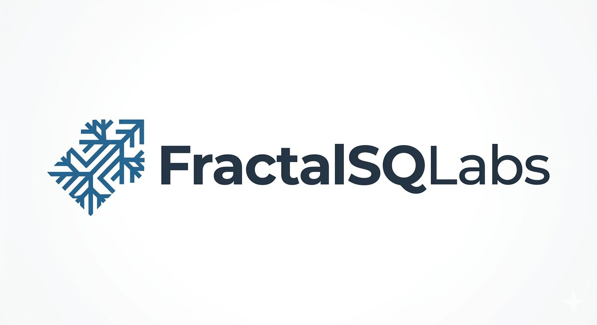

  

# .github

Organization-wide defaults for the
[FractalSQLabs](https://github.com/FractalSQLabs) GitHub org.

GitHub automatically reads certain files from a special repo named
`.github` and applies them as fallbacks to every other repository in
the organization. This repo is that.

## Contents

| File | What GitHub does with it |
|---|---|
| [`SECURITY.md`](SECURITY.md) | Rendered as the Security policy for every FractalSQLabs repository that doesn't ship its own `SECURITY.md`. Visitors see it at `github.com/FractalSQLabs/<repo>/security/policy`. |
| [`profile/README.md`](profile/README.md) | Rendered on the org landing page at [github.com/FractalSQLabs](https://github.com/FractalSQLabs). |

## Product repositories

The actual FractalSQL factories live in sibling repos, not here:

- [`mysql-fractalsql`](https://github.com/FractalSQLabs/mysql-fractalsql) — MySQL 8.0 / 8.4 LTS / 9.x UDF
- [`mariadb-fractalsql`](https://github.com/FractalSQLabs/mariadb-fractalsql) — MariaDB 10.6 / 10.11 / 11.4 LTS / 12.2 UDF
- [`postgresql-fractalsql`](https://github.com/FractalSQLabs/postgresql-fractalsql) — PostgreSQL 14 / 15 / 16 / 17 / 18 extension
- [`sqlite-fractalsql`](https://github.com/FractalSQLabs/sqlite-fractalsql) — SQLite 3.x loadable extension
- [`duckdb-fractalsql`](https://github.com/FractalSQLabs/duckdb-fractalsql) — DuckDB 1.2 / 1.4 / 1.5 extension
- [`redis-fractalsql`](https://github.com/FractalSQLabs/redis-fractalsql) — Redis 6.2 / 7.x / Memurai module
- [`valkey-fractalsql`](https://github.com/FractalSQLabs/valkey-fractalsql) — Valkey 7.2 / 8.0 / 8.1 module
- [`couchdb-fractalsql`](https://github.com/FractalSQLabs/couchdb-fractalsql) — CouchDB (early)

## Security

To report a vulnerability in any FractalSQLabs repository, see
[`SECURITY.md`](SECURITY.md). TL;DR — use GitHub's private
vulnerability reporting on the affected repo, or email
`security@fractalsqlabs.com`.

## License

The content of this repository (policy documents, profile README) is
MIT-licensed. The product repositories above each ship their own
`LICENSE` — see each repo's root.
